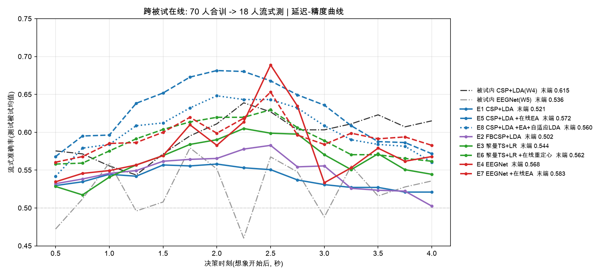
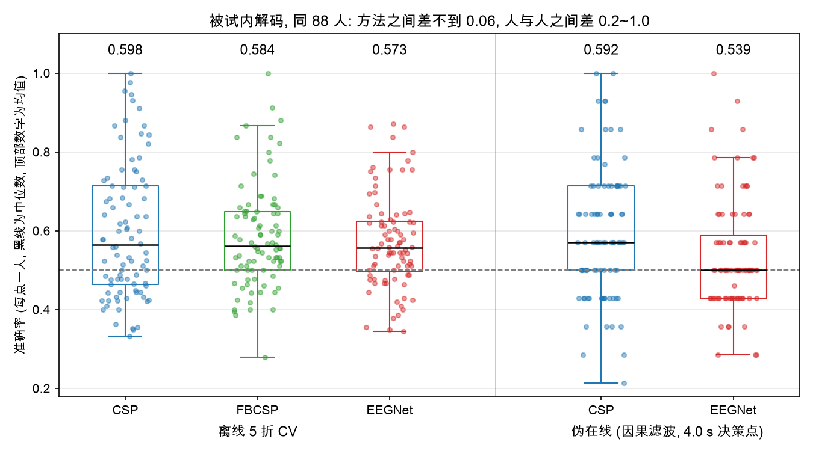
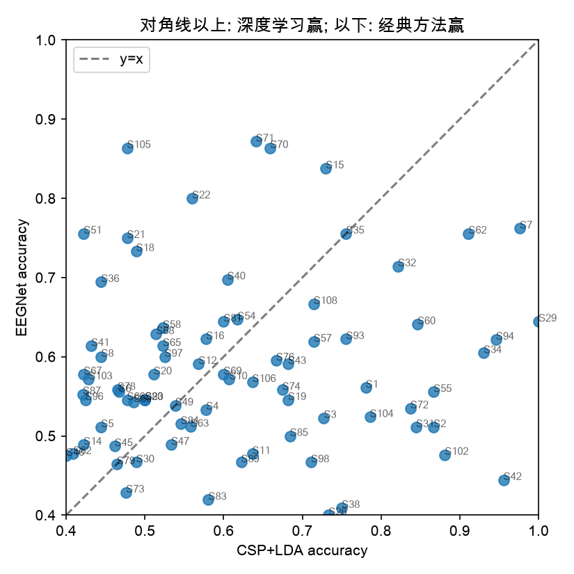

# MI-Decoder：运动想象 EEG 解码与在线评估

PhysioNet EEGBCI（109 被试、64 导、160 Hz）左手 / 右手运动想象二分类。
从原始 EDF 到"放到一个新人身上实时用还剩多少"的完整链路，每一步的中间产物都落盘、可单独复跑。

```
预处理 → ERD 生理验证 → 被试内解码 (CSP / FBCSP / EEGNet) → 伪在线因果模拟 → 跨被试在线解码 (E1~E8)
```

---

## 结果一览

### 跨被试在线：70 人合训，18 个新人流式测



横轴是想象开始后的决策时刻，纵轴是 18 个测试被试的流式准确率均值。黑 / 灰虚线是同一批人**自己的数据**训出来的被试内模型，作为参照。

| 方法 | 用目标被试什么 | 末端 acc (4.0 s) | 1.5~3.0 s 均值 | ≥0.6 人数 |
|---|---|---|---|---|
| 被试内 CSP+LDA（参照） | 自己的前 70% 试次 | 0.615 | 0.607 | — |
| 被试内 EEGNet（参照） | 自己的前 70% 试次 | 0.536 | 0.529 | — |
| E1 CSP+LDA | 无 | 0.521 | 0.549 | 4/18 |
| E2 FBCSP+LDA | 无 | 0.502 | 0.566 | 0/18 |
| E3 黎曼切空间+LR | 无 | 0.544 | 0.588 | 4/18 |
| E4 EEGNet | 无 | 0.568 | 0.605 | 9/18 |
| E5 CSP+LDA + 在线 EA | 无标签信号（因果对齐） | 0.572 | **0.663** | 8/18 |
| E6 黎曼+LR + 在线重定心 | 同上 | 0.562 | 0.612 | 6/18 |
| E7 EEGNet + 在线 EA | 同上 | **0.583** | 0.610 | 8/18 |
| E8 E5 + 自适应 LDA | 同上 + 伪标签 | 0.560 | 0.631 | 8/18 |

四句话结论：

1. **零校准直接掉到随机附近**：CSP 从被试内 0.615 掉到 0.521；FBCSP 最差，18 人无一过 0.6。
2. **EEGNet 是零校准下唯一均匀的增益**：比 CSP 高 +0.047，12/18 人受益。
3. **在线欧氏对齐（EA）让 CSP 在 1.5~3.0 s 反超被试内模型**（0.663 vs 0.607），但增益极不均匀：3 人 +0.18~0.27，1 人 −0.24，其余基本不动。
4. **方法之间差 ≤0.06，人与人之间差 0.4~0.87**：目标被试自己的 ERD 强度（`mu_contra_pct`）与迁移精度 r=−0.58；6 个无 ERD 的被试，八种方法全在 0.51。在本文测过的八种方法里，换方法救不了没有可测 ERD 的人。

### 被试内：88 被试离线 5 折 CV + 伪在线



| 方法 | acc | 备注 |
|---|---|---|
| CSP+LDA | 0.598 ± 0.170 | min 0.333, max 1.000 |
| FBCSP | 0.584 ± 0.130 | vs CSP p=0.42 |
| EEGNet | 0.573 ± 0.119 | vs CSP p=0.35；41/88 人 EEGNet 更高 |
| 伪在线 CSP，末端 acc | 0.592 | 106 人；静息期误触发率 0.89 |
| 伪在线 EEGNet，末端 acc | 0.537 | 静息期误触发率 0.17 |

<p align="center"></p>

均值上 CSP 和 EEGNet 打平，逐人看是互补的：CSP 强的经典被试 EEGNet 往往更低（S029 1.00→0.64），CSP 接近随机的被试 EEGNet 能拉回（S105 0.48→0.86，S101 0.36→0.78）。
`csp_acc` 与 ERD 深度 `mu_contra_pct` 的 Pearson r=−0.44，按 ERD 分档 strong 0.674 > medium 0.575 > none 0.537。

---

## 快速开始

```bash
cd mi_decoder
python -m venv .venv && source .venv/bin/activate
pip install -r requirements.txt
# 把 config.yaml 里 data.data_root 指向已下载的 EEGBCI 目录 (<root>/Sxxx/SxxxRxx.edf)

python -m src.preprocess                            # 1   ~1 min/被试
python -m src.validate_erd && python -m src.quantify_erd   # 2   ERD 出图 + 出数
python -m src.decode_csp                            # 3   几分钟
python -m src.decode_eegnet                         # 4   CPU 数十分钟; MPS/CUDA 更快
python -m src.pseudo_online                         # 5   CSP 伪在线
python -m src.pseudo_online --model eegnet          # 5   EEGNet 伪在线, ~15 min (MPS)
python -m src.decode_cross_subject                  # 6   E1,E3,E5,E6,E8
python -m src.decode_cross_subject --exps E2        # 6   FBCSP
python -m src.decode_cross_subject --exps E4,E7     # 6   EEGNet, 十几分钟到半小时
python -m src.report                                # 7
```

冒烟：`python -m src.preprocess --subjects 1 2 3`、`python -m src.pseudo_online --max-subjects 3`、`python -m src.decode_cross_subject --exps E1 --max-train 5 --max-test 2`。
只重画汇总图：`python -m src.decode_cross_subject --plot-only`。

---

## 流程与模块

```
EDF ──► preprocess ──► Sxxx-epo.fif ──────┬──► validate_erd / quantify_erd   (旁路诊断, 不进下游)
                   └─► Sxxx_clean_raw.fif  ├──► decode_csp ──► csp_results.csv
                                           ├──► decode_eegnet ──► eegnet_results.csv
                                           ├──► pseudo_online ──► pseudo_online_*.csv        ┐ 共用 online_models.py
                                           └──► decode_cross_subject ──► cross_subject_*.csv ┘ 同一条因果路径
                                                                  report ──► all_results.csv + report.md
```

| 脚本 | 做什么 | 关键设计 |
|---|---|---|
| `preprocess.py` | runs 4/8/12 拼接 → 坏导插值 → 平均参考 → 1~45 Hz → ICA 去眼电 → −1~4 s epoch | 坏导先于重参考；ICA 在宽带上做（眨眼能量在 1~5 Hz）；>350 µV 试次整个丢弃 |
| `validate_erd.py` | C3/C4 时频图 + mu 段地形图 | 逐试次算功率再平均（ERD 非锁相）；除法基线消 1/f |
| `quantify_erd.py` | `mu_contra_pct` 等数值指标 → `erd_quant.csv` | 对侧电极 8~13 Hz、0.5~3.5 s 功率变化 %；分四档 strong/medium/weak/none |
| `decode_csp.py` | CSP(6)+LDA 与 FBCSP 被试内 5 折 CV | 8~30 Hz，裁 0.5~3.5 s；`reg="ledoit_wolf"`（ICA 后协方差降秩，不收缩会 `LinAlgError`）；Pipeline 在 CV 内拟合 |
| `decode_eegnet.py` | EEGNetv4（2610 参数）同划分 5 折 CV | 1~40 Hz；z-score 只用训练折统计量；训练折内再留 20% 早停 |
| `online_models.py` | 因果流加载、流式 EA / 黎曼重定心、在线模型、时间顺序重放 | 被试内与跨被试共用，保证口径一致 |
| `pseudo_online.py` | 前 70% 试次训 → 后 30% 按时间顺序流式测 | `sosfilt` 因果滤波，**训练也在因果滤波后的数据上做**；0.5~4.0 s 每 0.25 s 一个决策点，回看 2 s 窗 |
| `decode_cross_subject.py` | 88 人随机切 70 训 / 18 测，测试被试全部试次流式重放 | 测试被试任何数据（含无标签）不进训练；E1~E8 见下表 |
| `report.py` | 合并指标、Wilcoxon 配对检验、出图、`report.md` | — |
| `plot_article.py` | 从已有 csv 画文章配图（ERD-准确率散点 / 因果-零相位滤波 / 伪在线 CSP vs EEGNet 曲线 / 被试内五列总结图） | 不重跑解码 |

数据链路（本次运行）：109 被试 → 排除 3 个 128 Hz 采样 → 106 完成预处理 → 4 人试次被幅值阈值剔光 → 18 人保留试次 <20 → **88 人进入解码**。

### 跨被试实验矩阵 E1~E8

| # | 模型 | 推理时用目标被试什么 |
|---|---|---|
| E1 | CSP(6)+LDA | 无（零校准） |
| E2 | FBCSP+LDA，5 子带各一条因果流 | 无 |
| E3 | 黎曼切空间 + LR | 无 |
| E4 | EEGNet 1~40 Hz，70 人中留 8 人早停 | 无 |
| E5 | CSP+LDA + 在线 EA | 每个窗用目标流 t 之前递归估计的参考协方差 R_t 白化（无标签、因果） |
| E6 | 黎曼 + LR + 在线重定心 | 同上，参考点为递归黎曼均值 |
| E7 | EEGNet + 在线 EA | 同 E5 |
| E8 | E5 + 自适应 LDA | 每试次末用伪标签递归更新类均值（Vidaurre 2011） |

E5~E8 训练集与 E1~E4 完全相同，只改推理，对比出"在线自适应值多少"。训练被试用整条流的终值参考协方差，测试被试在时刻 t 只用结束于 t 之前的窗，两侧收敛到同一统计量。

---

## 详细结论

<details>
<summary><b>方法层</b>（18 人配对 Wilcoxon，p 只作参考）</summary>

- **零校准掉点**：CSP 0.615→0.521；FBCSP 最差，子带切细后跨人频带差异被放大。
- **EEGNet 零校准增益均匀**：E4−E1 均值 +0.047、中位 +0.044，12/18 人（p=0.06）。
- **EA 增益高方差**：E5−E1 均值 +0.051 但中位仅 +0.02；S094/S012/S015 +0.18~0.27，S038 −0.24。对 EEGNet 增益更小（E7−E4 +0.015）。
- **排名依决策时刻而变**：末端 E7 最高，1.5~3.0 s E5 一枝独秀（峰 0.681 @2.0 s）。EEGNet 逐点抖动是 CSP 的两倍（相邻 offset 差 E4 0.061 vs E1 0.026），固定 2 s 输入对窗口落点敏感。E4~E8 之间 ≤0.02 的末端差别不能当结论。
- **自适应 LDA 无益**（E8−E5 −0.011，FPR 0.38→0.56）；**黎曼后验不可用**（FPR 0.80+，acc 不差但静息期频繁 ≥0.7）。
- **EEGNet 对在线约束比 CSP 敏感**：同 18 人离线 0.601 → 被试内在线 0.536（训练试次 36→31 再切验证、窗 3 s→2 s、因果滤波），CSP 同样约束下 0.589→0.615 不掉。跨被试 E4 0.568 高于被试内在线 0.536 但低于离线 0.601：70 人数据量补回了在线约束的一部分，不是"跨被试优于被试内"。

</details>

<details>
<summary><b>被试层</b>（为什么方法差异 ≤0.06 而人与人差 0.4~0.87）</summary>

- **ERD 强度预测迁移**：`mu_contra_pct` 与 E7 r=−0.58 (p=0.01)、E5 −0.45、E4 −0.43，与被试内 −0.53、与 88 人离线的 −0.44 同一条线。
- **6 人 none_or_reversed（占测试集 1/3）所有方法都在 0.51**：被试内 0.52、E1/E5/E4 0.51。在本文测过的方法族里掏不出可迁移的信号；族外方法（如预训练表示）能不能，未测。
- **离线可解码性预测可迁移性**：离线 5 折 CSP acc 与 E1 / E4 的 Spearman 均为 0.65 (p<0.01)。被试内在线只有 14 试次，与 E1 相关仅 0.30，不宜做逐人对照。
- EA 唯一大负例 S038 的 `mu_contra_pct`=+1.3（无 ERD），白化可能在放大噪声；单人证据，作假设。
- rest FPR 与 acc 逐人无相关（rho ≈ ±0.2）：FPR 是分类器校准属性，拒识阈值应按模型标定而非按人。

</details>

<details>
<summary><b>阅读结果时的注意事项</b></summary>

- **`best_acc` 是乐观数字**：在 14 个测试试次、15 个 offset 里挑最大值，含选择偏差。看在线性能用 `acc_at_end` 或整条曲线。
- **静息期误触发率 0.89**（被试内 CSP）：LDA 后验在 0.7 阈值下几乎不拒识，上线需要拒识策略。跨被试 CSP 的 FPR 只有 0.23~0.38 不是变好了，而是合训 LDA 边界更钝、后验向 0.5 收缩——acc 和 FPR 要一起看。
- **跨被试只做了一次 70/18 切分**：18 人均值标准误约 0.02~0.03，稳的只有方向。被试内数字基于每人后 30% 的 14 试次，跨被试基于 45 试次，两者直接比大小时要带上这句。
- **S029 CSP/FBCSP 均为 1.000**：过于完美，需看 CSP pattern 地形图排除肌电冒充。
- **ERD 不能用作试次级过滤**：按 ERD 强弱挑试次再评估是泄漏。被试级剔除只能作为 BCI illiteracy 分析披露，不能当主结果。
- ICA 在预处理阶段对整段录音无监督拟合，未按 70/30 切分；严格的在线系统应在校准段拟合后冻结。

</details>

---

## 目录与配置

```
mi_decoder/
├── config.yaml          # 全部参数
├── src/                 # 见上表, 每个脚本 python -m src.xxx 独立运行
├── notebooks/single_subject_demo.ipynb   # 单被试教学版, 逐步可视化
└── results/
    ├── processed/       # Sxxx-epo.fif, Sxxx_clean_raw.fif  (库里只保留 S001)
    ├── figures/         # 每被试 ERD 图与伪在线曲线 (库里只保留 S001) + 汇总图
    ├── metrics/         # 各模块 csv
    └── report.md
```

| `config.yaml` 段 | 关键参数 |
|---|---|
| `data` | `data_root`, `n_subjects=109`, `exclude_subjects=[88,92,100]`, `runs=[4,8,12]` |
| `preprocess` | `l_freq=1, h_freq=45, bad_z_thresh=2.6, ica_n_components=20, epoch −1~4 s, reject_eeg=350 µV` |
| `erd` | `freq 6~32 Hz, baseline [−1,0], plot_channels [C3,C4]` |
| `decode` | `band [8,30], crop [0.5,3.5], csp_components=6, fbcsp_bands, fbcsp_components=4, cv_folds=5` |
| `eegnet` | `band [1,40], max_epochs=100, patience=15, lr=1e-3, batch_size=16, val_ratio=0.2` |
| `pseudo_online` | `win_sec=2.0, step_sec=0.25, train_ratio=0.7, offsets [0.5,4.0,0.25], conf_threshold=0.7, adapt_eta=0.05` |
| `cross_subject` | `test_ratio=0.2, eegnet_val_subjects=8` |

环境：Python 3.12，MNE 1.13，scikit-learn，PyTorch，braindecode ≥0.8，pyriemann。macOS 上 EEGNet 自动使用 MPS。
